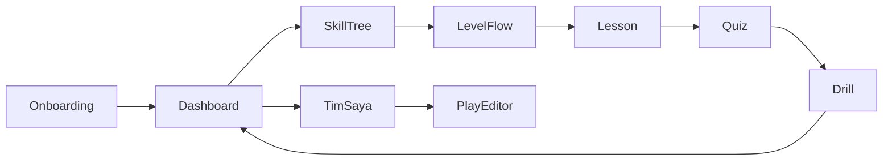

# PlayFlag — Product Requirements Document

**Version:** 1.0  
**Date:** 2026-08-01  
**Status:** Draft for review  
**Constraint:** Hackathon build window 3 jam · Cursor · web mobile-friendly  
**Domain rules:** IFAF Flag Football Rules 2023 (5v5) — lihat [`flag-football-context-ifaf-2023.md`](../../flag-football-context-ifaf-2023.md) di root repo

---

## 1. Problem & opportunity

Flag football akan menjadi olahraga Olimpiade 2028. Barrier entry tinggi: aturan berbeda dari tackle football (tidak ada “1st & 10”, line to gain = middle, non-kontak), dan jarang ada jalur belajar yang bertahap dari fundamental → drill → strategi permainan.

**PlayFlag** menutup gap itu: aplikasi belajar yang membuat entry terasa mudah dan menarik, progres terukur, serta memberi permukaan ringan untuk mengelola playbook tim — tanpa menjadi platform kompetisi atau sosial.

---

## 2. Product vision

> Pemula membuka PlayFlag, masuk jalur “Road to 2028”, menyelesaikan level (lesson → kuis → drill), melihat progres di dashboard, lalu menyusun formasi & rute di Tim Saya — siap bermain lebih percaya diri.

**Brand:** PlayFlag (hero-level, bukan hanya teks nav).  
**Tagline arah:** Road to 2028 — belajar flag football bertahap.

---

## 3. Goals & non-goals

### Goals

| ID | Goal |
|---|---|
| G1 | User pemula bisa belajar fundamental flag football dengan alur bertahap yang jelas |
| G2 | User merasakan progres nyata lewat dashboard (path + skill) |
| G3 | User bisa mengelola strategi sederhana untuk timnya (roster + play editor) |
| G4 | Demo end-to-end berjalan lancar dalam constraint 3 jam build |

### Non-goals (eksplisit)

- Aplikasi kompetisi / turnamen / scoreboard live / bracket
- Reclub / manajemen klub organisasi
- Sosial media, feed, chat, follow
- Auth multi-user / akun cloud
- Video, AR, motion tracking
- Animasi playback play
- Backend, database, realtime sync

---

## 4. Personas

### Primary — Pemain pemula solo

Ingin masuk flag football dengan cara yang menarik, mudah, dan bertahap. Ingin melihat progres dan merasa “menuju siap bermain / olimpiade”.

### Secondary surface — Kapten / pemain yang punya tim kecil

Bukan persona coach penuh. Hanya butuh satu layar: nama tim, roster 5, dan playbook yang bisa diedit (posisi + rute).

---

## 5. User stories

| ID | Story | Priority |
|---|---|---|
| US1 | Sebagai pemula, saya ingin onboarding singkat agar saya punya identitas di app dan memahami tujuan Road to 2028 | P1 |
| US2 | Sebagai pemula, saya ingin menyelesaikan level berisi lesson, kuis, dan drill agar saya belajar sambil berlatih | P1 |
| US3 | Sebagai pemula, saya ingin melihat dashboard progres yang menarik agar saya termotivasi lanjut | P1 |
| US4 | Sebagai pemula, saya ingin skill tree 8 langkah agar saya melihat perjalanan panjang, meski belum semua terbuka | P1 |
| US5 | Sebagai pemain, saya ingin mengelola Tim Saya (nama, roster, play dengan posisi + rute) agar strategi tim saya tersimpan | P1 |
| US6 | Sebagai user, saya ingin progres & playbook tetap ada setelah refresh agar demo/juri tidak hilang state | P1 |
| US7 | Sebagai pemula, saya ingin level 4–8 tersedia bertahap nanti agar visi kurikulum penuh tetap ada | P2/P3 |

---

## 6. Product loop & information architecture

### Phase 1 screens (wajib demo)

1. **Onboarding** — input nama tampilan + intro Road to 2028  
2. **Dashboard** — path progress, streak, radar skill SVG  
3. **Skill tree** — 8 node; 3 aktif (konten penuh), 5 locked dengan teaser  
4. **Level flow** — Lesson → Quiz (3 soal) → Drill (timer + target reps + catat hasil)  
5. **Tim Saya** — edit nama/roster ringan + play editor (mode posisi drag + mode rute/arrow)



### Navigation (Phase 1)

- Bottom atau top nav sederhana: **Dashboard** · **Belajar** (tree) · **Tim Saya**
- Level dibuka dari skill tree, bukan dari nav terpisah

---

## 7. Kurikulum

### Visi produk

8 level di skill tree (“Road to 2028”).

### Build phases

| Phase | Scope | Status di hackathon |
|---|---|---|
| **P1 — wajib demo** | Onboarding, dashboard, tree UI 8 node, **level 1–3 penuh**, Tim Saya + editor posisi+rute | Harus selesai |
| **P2 — stretch** | Konten level 4–5 | Jika sisa waktu |
| **P3 — backlog** | Level 6–8 + polish visual | Setelah hackathon |

### Level 1–3 (seed, IFAF-aligned)

| Level | Judul | Skill category | Isi |
|---|---|---|---|
| 1 | Rules dasar | Rules | Field, non-kontak, scoring dasar; kuis 3 soal; drill: **Zone walk** — timer + target 5 reps (user menandai/menyebut zone: endzone, middle, no-running zone) |
| 2 | Flag pull & movement | Movement | Cara pull flag, gerakan tanpa tackling; kuis; drill: **Flag pull** — timer + target 10 reps |
| 3 | Down & middle | Strategy | 4 downs, line to gain = middle, no-running zone intro; kuis; drill: **Down call** — timer + target 8 reps (sebut situasi down/middle hardal) |

### Level 4–8 (nama teaser di tree; konten P2/P3)

| Level | Judul teaser | Category |
|---|---|---|
| 4 | Offense basics | Strategy |
| 5 | Defense basics | Strategy |
| 6 | Situational plays | Strategy |
| 7 | Team chemistry drills | Movement |
| 8 | Road to 2028 capstone | Rules |

Node locked menampilkan teaser singkat; tidak bisa dimasuki sampai phase kontennya diisi.

### Unlock rules (Phase 1)

- **Konten vs unlock:** Level 1–3 punya konten penuh; Level 4–8 hanya teaser (tidak ada lesson/kuis/drill di P1)
- **Sequential gate (1–3):** Saat fresh install hanya Level 1 = `available`. Level 2 menjadi `available` setelah Level 1 `completed`; Level 3 setelah Level 2 `completed`
- **Teaser lock (4–8):** Selalu `locked` di P1; tap menampilkan teaser, tidak masuk flow
- Tim Saya / play editor **tersedia dari awal** (tidak digate oleh level) agar demo strategi tidak tergantung selesai 3 level

---

## 8. Feature specs

### 8.1 Onboarding

- Input: `displayName` (wajib, max 24 karakter)
- Setelah submit: tulis `profile` ke storage, arahkan ke Dashboard
- Bahasa UI: Indonesia; istilah teknis IFAF tetap English (flag pull, middle, down, blitz)

### 8.2 Dashboard

**Hero metrics (viewport utama):**

1. **Path bar** — % Road to 2028  
   - Formula: `(completedLevels.length / 8) * 100`, dibulatkan ke integer  
   - Di P1 penuh (3 level selesai): **38%** (3/8). Denominator tetap 8 (visi produk), bukan 3  
2. **Streak** — hari berturut dengan ≥1 aktivitas (selesai drill level, atau simpan play)  
   - Simpan `lastActiveDate` (YYYY-MM-DD, lokal browser)  
   - Jika aktivitas hari yang sama: streak tidak bertambah lagi  
   - Jika aktivitas besok dari `lastActiveDate`: `streak += 1`  
   - Jika gap ≥1 hari penuh: `streak = 1`  
3. **Radar SVG** — 3 sumbu: Rules, Movement, Strategy  
   - Per category: rata-rata `scorePercent` dari semua kuis di category itu; jika belum ada kuis → 0  
   - Ulangi kuis level yang sama: **skor terakhir menimpa** skor sebelumnya  
   - Implementasi: SVG polygon sederhana, **tanpa** Chart.js/Recharts

Urutan implementasi disarankan: alur belajar E2E dulu, baru polish radar.

### 8.3 Skill tree

- 8 node visual dalam satu path/journey
- Node state: `locked` | `available` | `completed`
- Tap node `available` → masuk Level flow
- Tap node `locked` → toast/inline teaser (“Buka di tahap berikutnya — Road to 2028”)
- Fresh install: hanya node 1 `available`; node 2–3 `locked` (punya konten, tunggu sequential gate); node 4–8 `locked` (teaser saja)

### 8.4 Level flow

**Lesson**

- Konten singkat (heading + 2–4 paragraf/bullet + 1 diagram opsional sederhana)
- CTA: “Lanjut ke kuis”

**Quiz**

- 3 soal multiple choice per level
- Tampilkan skor segera (benar/salah per soal + total)
- Skor disimpan ke category skill level tersebut
- CTA: “Lanjut ke drill” (boleh lanjut meski skor < 100%; Phase 1 tidak memaksa pass gate)

**Drill**

- Judul + instruksi singkat
- Target reps (angka seed)
- Timer start/stop
- Input hasil: reps dicapai (number)
- CTA: “Selesai level” → mark level completed, update path/streak/radar, kembali ke Dashboard atau Tree

### 8.5 Tim Saya

**Roster**

- Nama tim (editable)
- 5 slot pemain (nama + inisial); seed default boleh diganti

**Playbook / Play editor**

- List plays (seed 1–2 contoh + “Buat play baru”)
- Per play: nama, catatan singkat
- **Mode Posisi:** field statis; 5 chip pemain bisa digeser (drag); posisi disimpan sebagai koordinat relatif field (0–1)
- **Mode Rute (satu interaksi P1):** tap pemain sumber → tap titik tujuan di field → garis/arrow tersimpan; hapus rute lewat tombol pada rute terpilih. Tidak ada freehand multi-point di P1
- **Tidak ada:** animasi playback, collision physics, multi-frame animation, freehand drawing
- Persist ke `localStorage` bersama state lain (autosave on change)

---

## 9. Data model (client-only)

Persist key: `playflag:v1` (satu JSON blob).

```ts
type PlayFlagState = {
  profile: {
    displayName: string
    createdAt: string // ISO
    lastActiveDate: string // YYYY-MM-DD
    streak: number
  }
  progress: {
    completedLevels: number[] // e.g. [1, 2]
    quizScores: {
      // levelId -> { category, scorePercent }
      [levelId: number]: {
        category: 'Rules' | 'Movement' | 'Strategy'
        scorePercent: number
      }
    }
    drillLogs: Array<{
      levelId: number
      targetReps: number
      achievedReps: number
      durationSec: number
      at: string // ISO
    }>
  }
  team: {
    name: string
    roster: Array<{ id: string; name: string }> // length 5
    plays: Array<{
      id: string
      name: string
      notes: string
      players: Array<{ id: string; x: number; y: number }> // 0–1 normalized
      routes: Array<{
        id: string
        fromPlayerId: string
        to: { x: number; y: number } // tap endpoint di field
      }>
    }>
  }
}
```

Tidak ada sync server. Clear storage = reset progress (boleh sediakan tombol “Reset demo” di settings ringan atau hidden untuk presenter).

---

## 10. Technical approach

| Layer | Pilihan |
|---|---|
| App | Vite + React + TypeScript SPA |
| Styling | Tailwind (komponen manual; jangan init shadcn di jam terbatas) |
| Routing | `react-router-dom` |
| Data | Seed konten di modul TS/JSON; state di `localStorage` |
| Charts | Manual SVG + div bars — tanpa chart library |
| Deploy | Satu URL static (Netlify/Vercel) |
| Backend | Tidak ada |

Referensi stack SPA dari prep turnamen lama boleh dipakai untuk tooling, **bukan** untuk fitur scoreboard/turnamen.

---

## 11. Acceptance criteria

### End-to-end (harus lulus di demo)

| ID | Criterion |
|---|---|
| AC1 | User baru menyelesaikan onboarding dengan nama, lalu masuk Dashboard |
| AC2 | User membuka skill tree, melihat 8 node; fresh state: Level 1 `available`, Level 2–8 `locked`; setelah selesai 1–3: tiga node `completed`, Level 4–8 tetap `locked` |
| AC3 | User menyelesaikan Level 1: baca lesson → jawab 3 soal kuis → jalankan drill (timer + reps) → level marked complete |
| AC4 | Setelah Level 1, Dashboard memperbarui path % dan sumbu skill terkait di radar |
| AC5 | User membuka Tim Saya, mengubah nama tim atau roster, membuat/mengedit play (posisi + minimal 1 rute), menyimpan |
| AC6 | User me-refresh browser: profile, progress Level 1, dan play tetap ada |
| AC7 | Tidak ada fitur kompetisi, social, atau auth yang muncul di navigasi |

### Phase 1 quality bar

- Mobile-friendly: alur utama usable di lebar ~390px
- Tidak ada dead-end: setiap layar punya CTA jelas ke langkah berikutnya
- Konten Level 1–3 tidak kosong (lesson + 3 soal + 1 drill masing-masing)

---

## 12. Constraints & hackathon success

| Constraint | Implikasi |
|---|---|
| 3 jam build | P1 saja yang dijamin; P2/P3 tertulis sebagai roadmap |
| Cursor + workshop | Prioritas E2E cerita juri, bukan architecture perfection |
| Tanpa backend | Demo andal; trade-off: tidak sync antar device |

**Definisi menang (produk):** juri merasakan story “belajar → progres → strategi tim” dalam 2–3 menit demo tanpa crash, dengan narasi Olimpiade 2028 yang koheren.

**Bukan definisi menang:** 8 level konten penuh, editor setara tool profesional, atau backend production.

---

## 13. Localization

- UI copy: Bahasa Indonesia
- Istilah ruleset: English IFAF (contoh: flag pull, middle, down, no-running zone, blitz)
- Jangan menerjemahkan istilah yang mengubah makna teknis

---

## 14. Out of scope (pemotong — jangan dibangun di P1)

- Auth / OAuth / PIN server
- Express / Postgres / Railway API
- WebSocket / polling live score
- Bracket / klasemen / play-by-play input
- Play animation / film study
- Chart library (Chart.js, Recharts, dll.)
- shadcn/ui full init
- Push notification, PWA offline kompleks
- Multi-language toggle
- User-generated lesson CMS
- Freehand multi-point route drawing

---

## 15. Open decisions — resolved

Semua keputusan di bawah sudah dikunci lewat sesi grilling (2026-08-01):

| Topik | Putusan |
|---|---|
| Identitas produk | Learning & training (bukan turnamen) |
| Persona | Pemain + layar Tim Saya |
| Loop | Lesson → kuis → drill → dashboard → playbook |
| Persistensi | SPA + seed + `localStorage` |
| Editor | Posisi + rute (tanpa animasi) |
| Kurikulum | Visi 8; P1 = 3 hidup + 5 locked |
| Dashboard | Path bar + radar SVG 3 skill |
| Drill | Timer + target reps + catat hasil |
| Bahasa | ID + istilah IFAF EN |
| Brand | PlayFlag |

---

## 16. Next steps

1. Review & approve PRD ini oleh product owner
2. Tulis implementation plan (`writing-plans`) dari PRD
3. Implement Phase 1 saja sampai AC1–AC7 hijau
4. Jika sisa waktu: Phase 2 (level 4–5)

---

## Document history

| Date | Change |
|---|---|
| 2026-08-01 | v1.0 — PRD awal dari sesi grill-me / brainstorming |
| 2026-08-01 | v1.0.1 — Self-review: unlock states, path/streak/radar formulas, drill konkret, route UX P1 |
