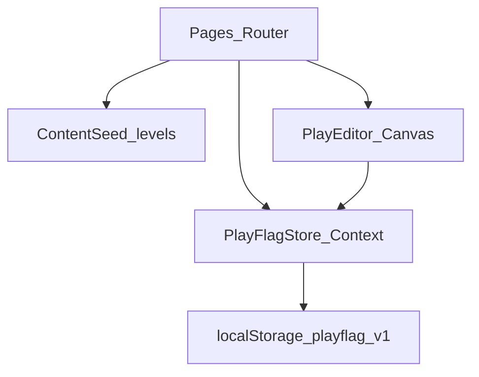

# RFC-001: PlayFlag Architecture

| Field | Value |
|---|---|
| **Status** | Draft for comments |
| **Date** | 2026-08-01 |
| **Product** | PlayFlag |
| **Related PRD** | [`docs/prd/2026-08-01-playflag-prd.md`](../prd/2026-08-01-playflag-prd.md) |
| **Domain rules** | [`flag-football-context-ifaf-2023.md`](../../flag-football-context-ifaf-2023.md) |
| **Constraint** | Hackathon build 3 jam · SPA only · mobile-friendly |

---

## 1. Summary

PlayFlag adalah SPA pembelajaran flag football (Road to 2028): onboarding → skill tree → level (lesson → kuis → drill) → dashboard progres, plus layar Tim Saya dengan **play editor berbasis Canvas** (posisi chip + rute arrow). Semua state hidup di client (`localStorage` key `playflag:v1`); tidak ada backend. RFC ini merinci *bagaimana* sistem dibangun; *apa* dan *mengapa* produk ada di PRD.

---

## 2. Motivation / Context

Barrier entry flag football tinggi (ruleset IFAF berbeda dari tackle football). PRD mengunci produk sebagai **learning & training**, bukan turnamen/scoreboard.

Kebutuhan teknis yang harus disepakati sebelum coding 3 jam:

1. Bentuk store & persistensi yang sederhana tapi cukup untuk progress + playbook
2. Batas play editor yang “terasa strategi” tanpa menghabiskan sisa waktu
3. Urutan implementasi yang menjamin demo end-to-end (AC1–AC7)

Dokumen ini meminta komentar pada keputusan arsitektur di bawah — terutama Canvas editor dan model reducer.

---

## 3. Goals & non-goals (teknis)

### Goals

| ID | Goal teknis |
|---|---|
| TG1 | Satu SPA deployable (Vite static) dengan routing jelas per layar Phase 1 |
| TG2 | State tunggal (`PlayFlagState`) + persist andal setelah refresh |
| TG3 | Level flow & dashboard membaca derived metrics (path %, streak, radar) dari state yang sama |
| TG4 | Play editor Canvas bounded: drag posisi + rute tap-to-tap, autosave ke store |
| TG5 | Demo checklist AC1–AC7 dari PRD dapat diselesaikan tanpa backend |

### Non-goals teknis

- Backend, auth, sync multi-device, realtime
- Zoom, pan, undo/redo stack pada editor
- Animasi playback play, freehand multi-point routes
- Chart library, shadcn init, Vitest/E2E di Phase 1
- Next.js SSR, Express, Postgres

---

## 4. Architecture overview



| Unit | Tanggung jawab | Dependensi |
|---|---|---|
| `ContentSeed` | Data statis level 1–3 + meta teaser 4–8 + roster/play default | Tidak ada |
| `PlayFlagStore` | Context + `useReducer` + load/save `localStorage` | Seed (initial team) |
| `Pages` | UI onboarding, dashboard, tree, level steps, team list | Store, Seed |
| `PlayEditor` | Canvas render + pointer hit-test + mode Posisi/Rute | Store (`UPSERT_PLAY`) |
| `selectors` | Pure functions: `pathPercent`, `touchActivity` (pure prediksi streak), `radarScores`, `nodeStatus` | State + Seed |

**Prinsip isolasi:** UI tidak menulis `localStorage` langsung; hanya dispatch action. Editor tidak punya persist sendiri — setiap perubahan play mendispatch `UPSERT_PLAY`.

---

## 5. Stack

| Layer | Pilihan |
|---|---|
| Bundler / app | Vite + React + TypeScript |
| Styling | Tailwind (komponen manual) |
| Routing | `react-router-dom` |
| State | React Context + `useReducer` |
| Persist | `localStorage` key `playflag:v1` |
| Charts | SVG polygon + div bar (tanpa library) |
| Deploy | Satu URL static (Netlify atau Vercel) |

---

## 6. Routing & screens

| Path | Layar | Catatan |
|---|---|---|
| `/` | Onboarding **atau** redirect | Jika `profile.displayName` ada → `/dashboard` |
| `/dashboard` | Dashboard | Path %, streak, radar SVG |
| `/learn` | Skill tree 8 node | Node status dari selector |
| `/learn/:levelId/lesson` | Lesson | Gate: level harus `available` atau `completed` |
| `/learn/:levelId/quiz` | Quiz 3 soal | |
| `/learn/:levelId/drill` | Drill timer + reps | `COMPLETE_DRILL` menutup level |
| `/team` | Tim Saya | Nama, roster, list plays |
| `/team/plays/:playId` | Play editor Canvas | Mode Posisi / Rute |

Nav utama (setelah onboarding): **Dashboard** · **Belajar** · **Tim Saya**.

Guard: akses `/learn/:levelId/*` untuk level `locked` → kembali ke `/learn` + pesan teaser.

---

## 7. State & reducer

### Shape

Schema version tersirat di key storage (`v1`). Bentuk mengikuti PRD; `profile` boleh `null` sebelum onboarding.

```ts
type SkillCategory = 'Rules' | 'Movement' | 'Strategy'

type PlayFlagState = {
  profile: null | {
    displayName: string
    createdAt: string
    lastActiveDate: string // YYYY-MM-DD lokal
    streak: number
  }
  progress: {
    completedLevels: number[]
    quizScores: Record<
      number,
      { category: SkillCategory; scorePercent: number }
    >
    drillLogs: Array<{
      levelId: number
      targetReps: number
      achievedReps: number
      durationSec: number
      at: string
    }>
  }
  team: {
    name: string
    roster: Array<{ id: string; name: string }> // length 5
    plays: Array<{
      id: string
      name: string
      notes: string
      players: Array<{ id: string; x: number; y: number }> // 0–1
      routes: Array<{
        id: string
        fromPlayerId: string
        to: { x: number; y: number }
      }>
    }>
  }
}
```

### Actions (inti Phase 1)

| Action | Efek |
|---|---|
| `COMPLETE_ONBOARDING` | Set `profile` (streak=1, lastActiveDate=hari ini); pastikan `team` seed ada |
| `SUBMIT_QUIZ` | Simpan/timpa `quizScores[levelId]`; tidak menambah streak sendiri |
| `COMPLETE_DRILL` | Append `drillLogs`; tambah `levelId` ke `completedLevels` jika belum; jalankan `touchActivity` (streak) |
| `UPDATE_TEAM_META` | Nama tim / roster |
| `UPSERT_PLAY` | Insert atau replace play by `id` (termasuk hapus rute dengan mengirim `routes` tanpa item itu); `touchActivity` |
| `RESET_DEMO` | Hapus storage / kembali ke initial state (untuk presenter) |

`touchActivity(today)`:

- Hari sama dengan `lastActiveDate` → streak tidak berubah
- Besok dari `lastActiveDate` → `streak += 1`
- Gap ≥ 1 hari penuh → `streak = 1`
- Update `lastActiveDate = today`

### Derived selectors (hitung di render; tidak disimpan)

| Selector | Formula |
|---|---|
| `pathPercent` | `Math.round((completedLevels.length / 8) * 100)` |
| `radarScores` | Per category: rata-rata `scorePercent` kuis di category itu; kosong → 0 |
| `nodeStatus(levelId)` | Lihat aturan unlock PRD (sequential 1–3; 4–8 selalu locked di P1) |

---

## 8. Persistensi

1. **Load (boot):** baca `localStorage.getItem('playflag:v1')` → `JSON.parse` → validasi minimal (`team.roster.length === 5` atau perbaiki). Gagal parse → `createInitialState()` + flag `recoveredFromCorruptStorage`.
2. **Save:** setelah setiap dispatch sukses, `JSON.stringify(state)` → `setItem`. Debounce tidak wajib di P1 (payload kecil); boleh `queueMicrotask` agar tidak blok paint.
3. **Tidak ada** migrasi multi-version di P1. Ganti key jika breaking change nanti (`playflag:v2`).

---

## 9. Content seed

Modul murni data, contoh shape:

```ts
type LevelSeed = {
  id: number
  title: string
  category: SkillCategory
  statusInP1: 'full' | 'teaser'
  teaser?: string
  lesson?: { heading: string; bullets: string[] }
  quiz?: Array<{
    id: string
    prompt: string
    choices: string[]
    correctIndex: number
  }> // length 3 jika full
  drill?: {
    title: string
    instructions: string
    targetReps: number
  }
}
```

Phase 1:

| Level | Judul | Category | P1 |
|---|---|---|---|
| 1 | Rules dasar | Rules | full — Zone walk, 5 reps |
| 2 | Flag pull & movement | Movement | full — Flag pull, 10 reps |
| 3 | Down & middle | Strategy | full — Down call, 8 reps |
| 4–8 | Teaser (Offense / Defense / … / Capstone) | — | `teaser` only |

---

## 10. Play Editor (Canvas)

### Keputusan

Editor memakai **satu elemen `<canvas>`** untuk field, chip pemain, dan rute. Ini detail implementasi di atas requirement PRD (posisi + rute); dipilih untuk kesatuan visual “lab” di demo.

### Batas Phase 1 (wajib dihormati)

- Tidak ada zoom, pan, undo/redo
- Tidak ada animasi playback
- Tidak ada freehand multi-point; rute = tap pemain → tap endpoint
- Tidak ada physics/collision antar chip

### Koordinat

- Model data: `x,y` dinormalisasi **0–1** relatif field (origin kiri-atas logical)
- Render: kalikan dengan `canvas.width/height` CSS pixels × `devicePixelRatio` untuk ketajaman retina
- Resize: `ResizeObserver` pada container; redraw penuh

### Hit-testing

- Chip: lingkaran radius tetap di ruang canvas (usulan awal **24 CSS px**); pilih chip terdekat dalam radius
- Mode **Posisi:** pointerdown pada chip → pointermove update `x,y` (clamp 0–1) → pointerup → `UPSERT_PLAY`
- Mode **Rute:** (1) tap chip set `routeFromPlayerId`; (2) tap field set `to` → push route → `UPSERT_PLAY`; tap chip lain membatalkan/ mengganti sumber
- Hapus rute: kontrol UI di luar canvas (list rute + tombol hapus), bukan gesture canvas

### State mesin UI editor (lokal komponen)

```text
mode: 'position' | 'route'
routeDraft: null | { fromPlayerId: string }
selectedRouteId: null | string
```

Tidak masuk global reducer kecuali hasil akhir play.

### Draw order

1. Field background (hijau + garis middle + endzone sederhana)
2. Routes (garis + arrow head)
3. Player chips (lingkaran + inisial dari roster)

---

## 11. Error handling

| Situasi | Perilaku |
|---|---|
| JSON corrupt / schema rusak | Reset ke `createInitialState()`; tampilkan banner sekali “Data demo dipulihkan” |
| `profile === null` di route terlindungi | Redirect `/` |
| Level locked diakses via URL | Redirect `/learn` + teaser |
| Play id tidak ada | Redirect `/team` |
| `localStorage` quota / disabled | App tetap jalan in-memory; banner “Progres tidak tersimpan”; log `console.warn` |

---

## 12. Verification (Phase 1)

Tidak ada Vitest/RTL/E2E di jendela 3 jam.

**Manual demo checklist** = AC1–AC7 PRD:

1. Onboarding → Dashboard  
2. Skill tree: 8 node; fresh = Level 1 available  
3. Selesaikan Level 1 (lesson → quiz → drill)  
4. Path % + radar terbarui  
5. Tim Saya: edit meta + play (posisi + ≥1 rute)  
6. Refresh: state bertahan  
7. Tidak ada nav kompetisi/social/auth  

Pure-function unit tests (`pathPercent`, `touchActivity`, hit-test) **boleh** ditambahkan post-hackathon; bukan syarat P1.

---

## 13. Alternatives considered

| Alternatif | Alasan ditolak untuk P1 |
|---|---|
| Zustand + persist | Dependency ekstra; Context+reducer sudah cukup |
| Editor DOM + SVG overlay | Valid & lebih mudah a11y; diganti Canvas atas permintaan visual tunggal — tetap cadangan jika Canvas macet di jam ke-2 |
| HTML5 Drag and Drop | Lemah di touch/mobile |
| Next.js static export | Setup/deploy lebih rentan di jam terbatas |
| Express + Postgres | Bertentangan non-goals; risiko CORS/DB |
| Chart.js / Recharts | Overhead; radar SVG manual cukup |

---

## 14. Open questions for comments

Mohon komentar khususnya pada poin berikut:

1. **Hit radius 24 CSS px** — cukup untuk jari di HP ~390px, atau perlu 32px?
2. **Autosave setiap `pointerup` / setiap rute baru** vs debounce 100ms — mana yang lebih aman untuk jank di device lemah?
3. **Radar:** selalu derived di render (sekarang) vs cache di state saat `SUBMIT_QUIZ` — ada alasan kuat untuk cache?
4. **Canvas vs fallback SVG+DOM:** jika di menit ke-90 Canvas belum stabil, apakah RFC mengizinkan switch ke alternatif DOM tanpa ubah data model? (Usulan: **ya**, data model tetap 0–1 + routes.)
5. **Apakah PRD perlu di-amend** satu kalimat bahwa editor “diimplementasikan dengan Canvas (atau setara)” agar dokumen produk selaras RFC?

---

## 15. Implementation order (3 jam)

| Slot | Fokus | Exit criteria |
|---|---|---|
| 0:00–0:25 | Scaffold Vite/React/TS/Tailwind/router; `PlayFlagStore` + persist; seed skeleton | Refresh mempertahankan state dummy |
| 0:25–0:50 | Onboarding + Dashboard shell (path bar + streak angka) | AC1 |
| 0:50–1:30 | Skill tree + Level 1 penuh (lesson/quiz/drill) + selectors unlock | AC2–AC4 untuk Level 1 |
| 1:30–1:50 | Level 2–3 konten (copy + wiring sama) | Tiga level full |
| 1:50–2:40 | Tim Saya + Canvas editor (posisi + rute) | AC5–AC6 |
| 2:40–3:00 | Radar SVG polish, teaser node 4–8, Reset demo, dry-run AC1–AC7 | Demo siap |

Jika Canvas terlambat: jatuhkan ke DOM+SVG (open question 4) tanpa mengubah seed/store.

---

## 16. Module map (usulan folder)

```text
src/
  app/           # router, providers, layout/nav
  store/         # context, reducer, persist, selectors, types
  content/       # levels.ts, teamDefaults.ts
  pages/         # Onboarding, Dashboard, LearnTree, Lesson, Quiz, Drill, Team, PlayEditorPage
  components/    # PathBar, SkillRadar, LevelNode, DrillTimer, PlayCanvas
  lib/           # dates (local YYYY-MM-DD), id()
```

Nama file boleh disesuaikan saat implementasi; **batas modul** di §4 yang mengikat.

---

## 17. Document history

| Date | Change |
|---|---|
| 2026-08-01 | RFC-001 Draft for comments — dari PRD + sesi grill arsitektur |
| 2026-08-01 | Self-review: hapus ambiguitas `DELETE_ROUTE`; samakan nama selector streak |

---

## 18. Request for comments

Silakan review RFC ini dan berikan komentar pada **Open questions (§14)** serta keputusan Canvas bounded (§10). Setelah disetujui, langkah berikutnya adalah implementation plan (`writing-plans`), lalu coding Phase 1 saja.
