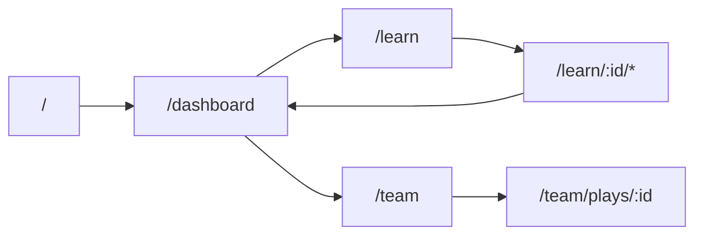

# PlayFlag Phase 1 Implementation Plan

I'm using the **writing-plans** skill. Full task checklist will also be saved to [`docs/superpowers/plans/2026-08-01-playflag-phase1.md`](docs/superpowers/plans/2026-08-01-playflag-phase1.md) during execution.

**Goal:** Ship a demoable PlayFlag SPA: onboarding → learn (levels 1–3) → dashboard progress → Tim Saya play editor, persisted in `localStorage`, then push to GitHub with a README.

**Architecture:** Client-only Vite + React + TS SPA. Single `PlayFlagStore` (Context + `useReducer`) persists to `playflag:v1`. Pages read seed content + selectors; Canvas play editor dispatches `UPSERT_PLAY` only. No backend, auth, or chart libraries.

**Tech stack:** Vite, React 18, TypeScript, Tailwind, `react-router-dom`, Canvas 2D, static deploy.

**Sources of truth:** [PRD](docs/prd/2026-08-01-playflag-prd.md), [RFC-001](docs/rfc/2026-08-01-playflag-architecture.md), [IFAF context](flag-football-context-ifaf-2023.md).

## Locked decisions (RFC §14)

- Hit radius chip: **28 CSS px** (mobile-friendly vs RFC’s 24)
- Autosave: on **pointerup** / each new route (no debounce)
- Radar: always **derived in render** via `radarScores`
- Editor: **Canvas first**; DOM+SVG only if Canvas blocks demo
- Verification P1: **manual AC1–AC7** (no Vitest in hackathon window, per RFC §12)

## Global constraints

- UI copy: Bahasa Indonesia; IFAF terms stay English (flag pull, middle, down, blitz, no-running zone)
- Brand: **PlayFlag** hero-level; tagline Road to 2028
- Persist key: `playflag:v1` only
- Path % denominator always **8** (3 completed = 38%)
- Levels 4–8: teaser/`locked` only; Tim Saya available from start
- Out of scope: auth, backend, competition, chart libs, shadcn, play animation, freehand routes
- Public repo: do **not** commit `.agents/`, `.claude/`, or local skill caches — app + product docs only

## Target module map

```text
src/
  app/           # App.tsx, router, AppLayout (nav), providers
  store/         # types, initialState, reducer, persist, StoreProvider, selectors
  content/       # levels.ts (1–3 full + 4–8 teaser), teamDefaults.ts
  pages/         # Onboarding, Dashboard, LearnTree, Lesson, Quiz, Drill, Team, PlayEditorPage
  components/    # PathBar, SkillRadar, LevelNode, DrillTimer, PlayCanvas
  lib/           # dates.ts (local YYYY-MM-DD), id.ts
```

Routes match RFC §6: `/`, `/dashboard`, `/learn`, `/learn/:levelId/{lesson|quiz|drill}`, `/team`, `/team/plays/:playId`.



## Implementation order (aligned with RFC §15)

### Task 1 — Scaffold + store + persist
- `npm create vite@latest` (React-TS), add Tailwind + `react-router-dom`
- Implement `PlayFlagState` types, `createInitialState()` (seed team), reducer actions: `COMPLETE_ONBOARDING`, `SUBMIT_QUIZ`, `COMPLETE_DRILL`, `UPDATE_TEAM_META`, `UPSERT_PLAY`, `RESET_DEMO`
- `loadState` / `saveState` for `playflag:v1`; corrupt → reset + recovery banner flag
- Pure selectors: `pathPercent`, `touchActivity`, `radarScores`, `nodeStatus` (sequential 1–3; 4–8 always locked)
- Smoke: mutate state → refresh → state survives

### Task 2 — Onboarding + shell nav + Dashboard metrics
- `/` onboarding (`displayName` max 24) → `COMPLETE_ONBOARDING` → `/dashboard`
- Guard: no profile → `/`; has profile on `/` → `/dashboard`
- Layout nav: Dashboard · Belajar · Tim Saya
- Dashboard: path bar + streak number (radar placeholder OK until Task 6)
- Exit: **AC1**

### Task 3 — Skill tree + Level 1 E2E
- Seed Level 1 (Rules): lesson, 3 quiz items, drill Zone walk (5 reps)
- `/learn` 8 nodes; tap locked → teaser; tap available → lesson
- Lesson → Quiz (`SUBMIT_QUIZ`) → Drill (`COMPLETE_DRILL` + `touchActivity`) → dashboard/tree
- Exit: **AC2–AC4** for Level 1

### Task 4 — Levels 2–3 content
- Level 2 Movement: Flag pull, 10 reps; Level 3 Strategy: Down call, 8 reps
- Same wiring as Level 1; unlock after prior `completed`
- Exit: three full levels playable

### Task 5 — Tim Saya + Canvas play editor
- Team meta + 5 roster slots; list plays + create play
- `PlayCanvas`: field draw, mode Posisi (drag chips), mode Rute (tap player → tap field), route list + delete
- Coords 0–1; `ResizeObserver`; autosave via `UPSERT_PLAY` (+ streak touch)
- Exit: **AC5–AC6**

### Task 6 — Polish + demo readiness
- SkillRadar SVG polygon (Rules / Movement / Strategy)
- Teaser copy nodes 4–8; Reset demo control
- Mobile ~390px pass; dry-run **AC1–AC7**
- Fallback only if Canvas fails: same data model, SVG/DOM chips

### Task 7 — README + git remote push
- Write root [`README.md`](README.md): what PlayFlag is, Road to 2028 story, Phase 1 features, stack, `npm install` / `npm run dev` / `npm run build`, localStorage note, link PRD/RFC, demo checklist
- `.gitignore`: `node_modules`, `dist`, `.env*`, `.agents`, `.claude`
- `git init`, commit Phase 1 + docs (PRD, RFC, IFAF context, plan, README)
- Add remote `https://github.com/mnakhyar/playflag.git`, push to **`main`** (user explicitly requested)
- If remote already has commits: pull/rebase or force only if user confirms empty overwrite — prefer merge-friendly first push with `-u origin main`

## README outline (to write)

1. **PlayFlag** — learn flag football toward Olympic 2028
2. Why (entry barrier / IFAF vs tackle)
3. What’s in Phase 1 (screens + levels 1–3)
4. Quick start
5. Architecture one-liner + doc links
6. Demo script (2–3 min AC path)

## Out of this push

- Level 4–5 content (P2), Vitest suite, Vercel/Netlify deploy config (optional stretch after green AC), agent skill folders
